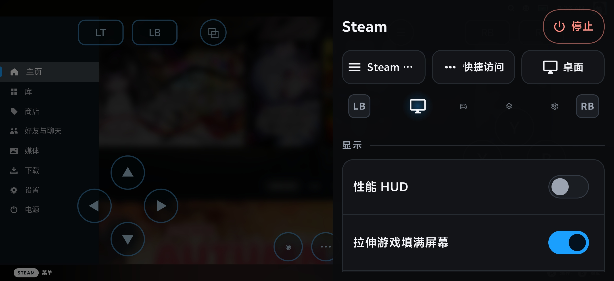
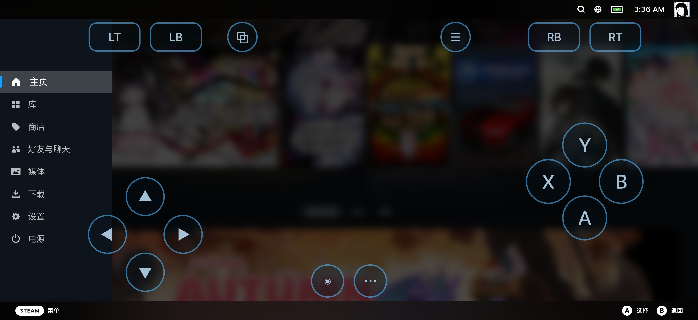
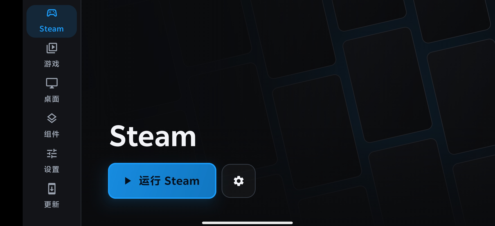

# droiddeck-zh-cn

[中文](README.md) | **English**

A complete Chinese localization of [DroidDeck](https://github.com/Droid-Deck/DroidDeck) 0.3.0, with built-in CJK fonts, ready to use out of the box.

## Differences from Upstream

| Feature | Upstream | This Build |
|---|---|---|
| UI Language | English/Spanish only | ✅ Full Simplified Chinese (928 strings) |
| CJK Fonts | None (shows □□□) | ✅ Bundled Noto Sans CJK (16MB) |
| Font Deploy | Manual install | ✅ Auto-deployed on session start |
| Terminology | No standard | ✅ steam-l10n glossary (1200+ entries) |
| Chinese Locale | None | ✅ zh-rCN / zh-rTW / zh coverage |
| Android 16 (API 36) | `File(File, String)` removed | ✅ Fixed to `File(String, String)` |

## Install

1. Download [DroidDeck-0.3.0-zhCN-font.apk](https://github.com/Lightfallingonionroom/droiddeck-zh-cn/releases/download/v0.3.0-zhCN/DroidDeck-0.3.0-zhCN-font.apk)
2. **Uninstall upstream DroidDeck first** (different signature)
3. Install this APK
4. After first launch: Developer options → Disable "Restrict child processes" (or use in-app "Fix it for me")

## Localization Coverage

- **928 UI strings**: Launcher, Settings, Components, Store, Updates, Sessions, Controls, Game Management — all interfaces
- **Unified terminology**: steam-l10n glossary (Steam/Proton/DXVK/Gamescope/Turnip/LSFG and other proper nouns)
- **Chinese locale support**: values-zh-rCN / values-zh-rTW / values-zh (covers Simplified, Traditional, and all Chinese devices)

## Screenshots

| DroidDeck Launcher | Steam Client | Settings |
|---|---|---|
|  |  |  |
| Fully Chinese UI | Steam client shows Chinese | Settings fully localized |

## Technical Details

- **Resource merge**: 1011 strings (928 UI + 83 Material Components library translations)
- **Font injection**: smali patch in `SessionActivity.surfaceCreated()` auto-deploys fonts to `linuxfs/usr/share/fonts/`
- **Android 16 fix**: `File(File, String)` constructor removed in API 36 — patched to use `File(String, String)`
- **Signature**: debug.keystore (different from upstream, requires uninstalling upstream first)

## Files

| File | Description |
|---|---|
| `DroidDeck-0.3.0-zhCN-font.apk` | Localized APK (45.4MB, includes CJK font) |
| `strings-zhCN.xml` | Complete Chinese resource file (928 entries, ready for source build) |
| `steam-l10n-terms.md` | Steam/DroidDeck terminology glossary (1200+ entries) |

## Build from Source

Copy `strings-zhCN.xml` to `app/src/main/res/values-zh-rCN/strings.xml` in the upstream source, then follow the official build process.

## Disclaimer

- This project is a community localization derivative of DroidDeck, licensed under **GPL-3.0**
- Original work © [Droid-Deck](https://github.com/Droid-Deck/DroidDeck)
- Localization work (translated strings, glossary, font injection patch) contributed by the community

## Acknowledgments

- Upstream: [Droid-Deck/DroidDeck](https://github.com/Droid-Deck/DroidDeck)
- Translation glossary: [steam-l10n](steam-l10n-terms.md) (self-built)
- Font: [Noto Sans CJK SC](https://github.com/notofonts/noto-cjk) (SIL Open Font License)